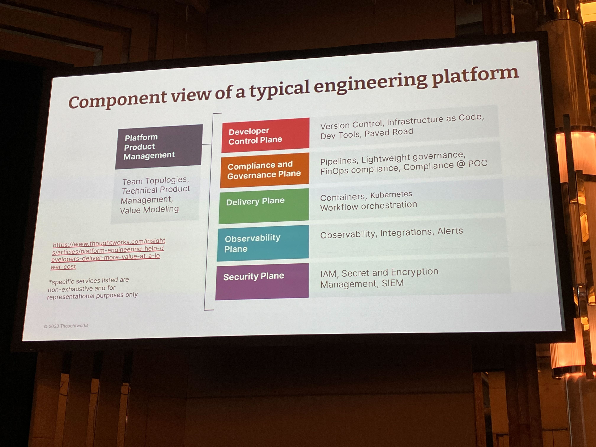
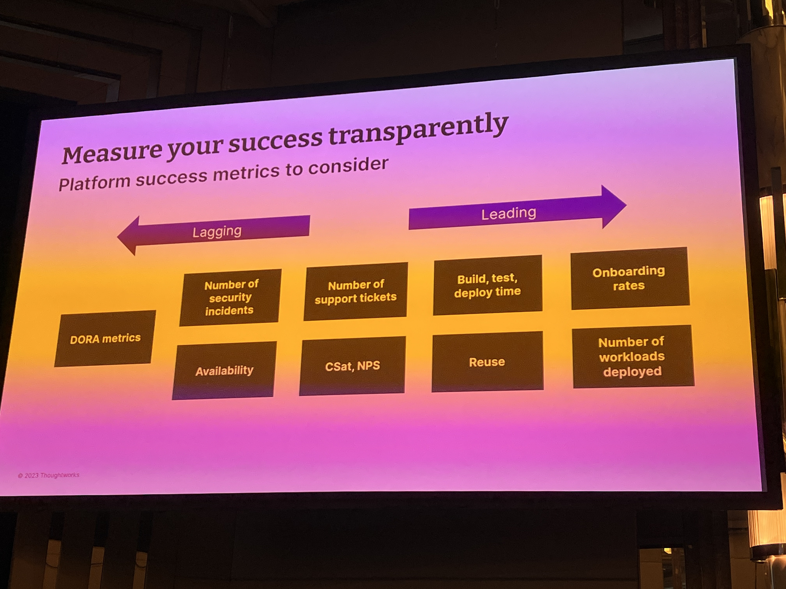
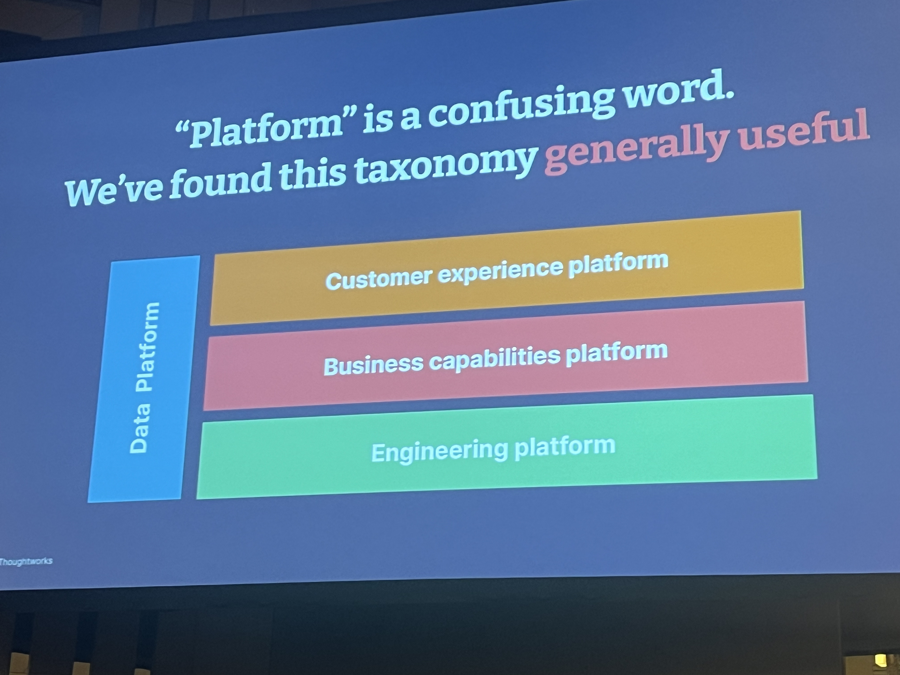
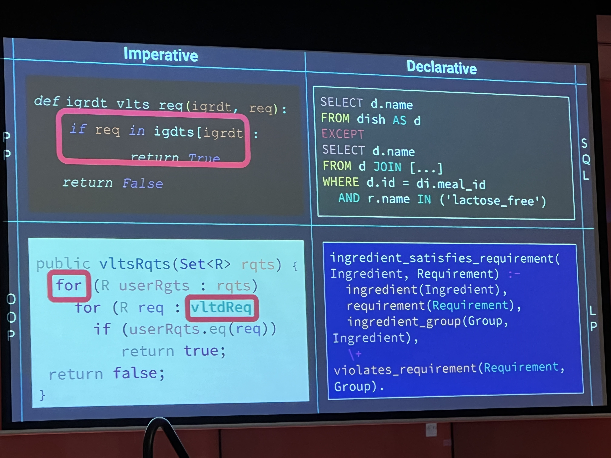
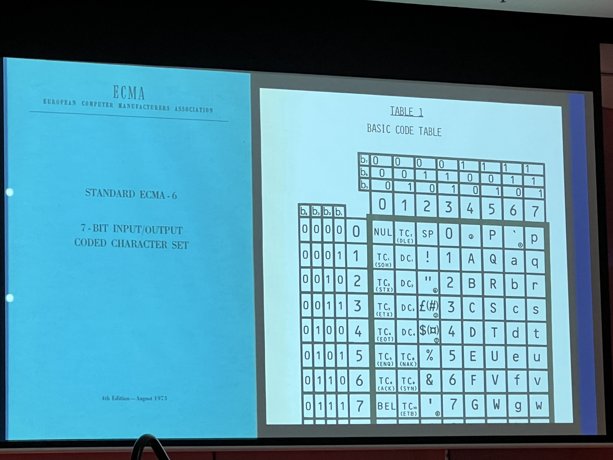
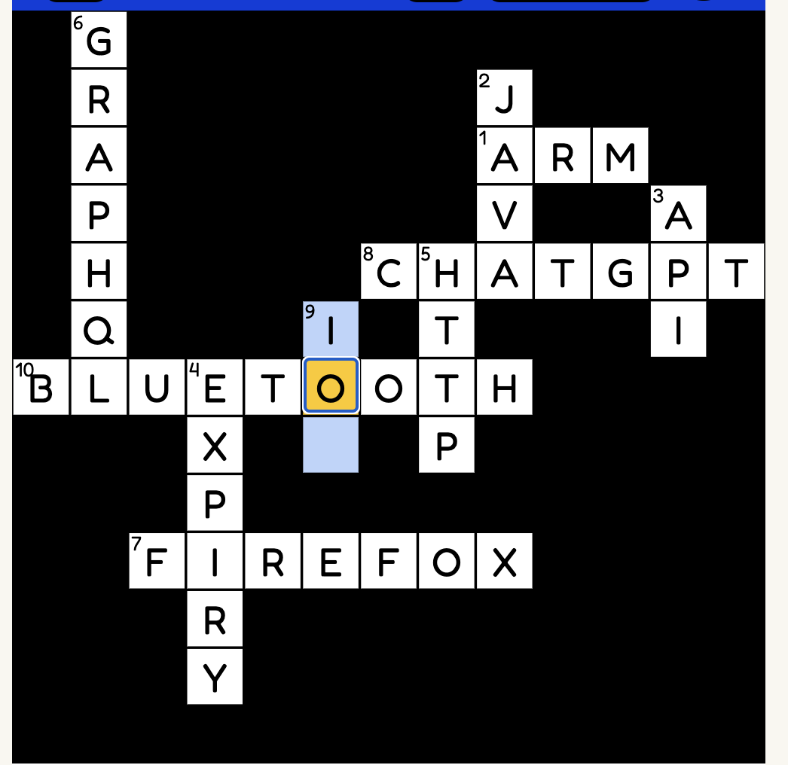
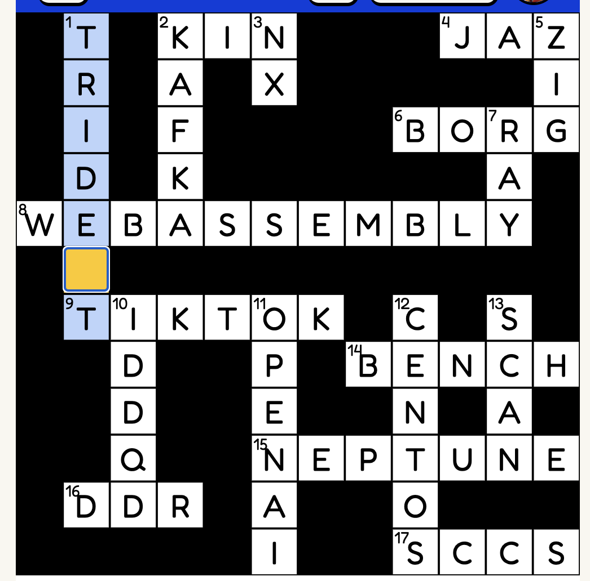
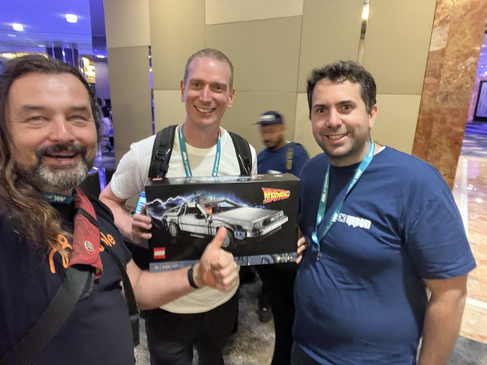

# Progrmmable Melbourne 2024

https://www.programmable.tech/melbourne-agenda

Tue 19th March 2024 - Hyatt Melbourne

---

**Engineering Platforms Evolved**
Scott Shaw

- discussion of platform engineering and it's progression from:
  - sys admin -> devOps -> Platform Engineering
- the idea of looking at things as platforms: data, engineering,
  business capabilities through things like APIs
- different ways of measuring value: surveys? the best being
  **value stream mapping** and utilising that as a tool to find
  biggest bottlenecks and what to focus on.
- measure and share - spreadsheets are good for the higher ups
- a platform team will be more effective if it is sponsored from a
  higher up CTO rather than a lower down Engineering Manager
- a Mention of DevEx and SPACE and the whole idea of state of flow
    - [ ]  [DevEx, a New Metrics Framework from the Authors of
      SPACE](https://www.infoq.com/articles/devex-metrics-framework/)
    - [ ]  [The of SPACE Developer Productivity
      ](https://dl.acm.org/doi/10.1145/3454122.3454124)
- if you gather metrics decide on:
    - what is the baseline?
    - natural variation
    - use composite over single to make less likely to game
    - what is failure? what is success?
    - what will lead to what action?
- dashboard example
    - [We’ve gone Backstage — This is how we use it on our Digital
      Platform - Rob Hornby
      ](https://medium.com/john-lewis-software-engineering/weve-gone-backstage-this-is-how-we-use-it-on-our-digital-platform-b299cd4acb24)
- quote from co-worker around
    > "softare is a communications Medium of knowledge you have
    > gatherd"
- I was not very impressed about the talk althought it did kind of
  play into my recent interest in measuring efficiency sparked by
  the paper
    - [Increasing, not Diminishing: Investigating the Returns of
      Highly Maintainable Code - Markus Borg
      ](https://arxiv.org/pdf/2401.13407.pdf)
    - in which case I should probably listen to Scott's podcast
      around [Beyond the DORA metrics: Measuring engineering
      excellence](https://www.thoughtworks.com/en-in/insights/podcasts/technology-podcasts/beyond-dora-metrics-measuring-engineering-excellence)

{: width="480"}



---

**The right tool for the job: How to use programming paradigms to reframe a problem**
Mirjam Uher

- quotes from [The Paradigms of Programming - Robert W. Floyd
  ](https://dl.acm.org/doi/10.1145/359138.359140)
  - along the lines

  > continued advance in programming will require the continuing
  > invention, elaboration, and communication of new paradigms.

  - ie get good at different paradigms

  > solve and solve again till I find the general rule

  - as such Mirjam decided to code up a "Chewsy Planner" using
    various paradigms
- an interest in computer paradignms along the lines of "blut
  lecken" -> "taste blood" 
- covering
    - **Imperative**
        - procedural
        - Object Oriented - the analogy is an organic cell
    - **Declarative**
        - DSL - SQL
        - Logical Programming - Prolog



- certainly inspired me to take another look at:
    - lua
    - prolog
    - [pragprog: Seven Languages in Seven
      Weeks](https://pragprog.com/titles/btlang/seven-languages-in-seven-weeks/)
      (prolog)
    - [Seven More Languages in Seven
      Weeks](https://pragprog.com/titles/7lang/seven-more-languages-in-seven-weeks)
      (lua)
    - ocaml
- demo links
    - https://replit.com/@mirjamuher/proceduralmealplanner
    - https://replit.com/@mirjamuher/OOMealFinder
    - https://replit.com/@mirjamuher/SQLMealFinder
    - https://replit.com/@mirjamuher/logicalMealFinder
    - https://www.linkedin.com/in/mirjam-uher/

---

**Turning 'wat' into 'why'**
Katie McLaughlin
 
some cool code conundrums, mostly around comparison or addition and how looking
at the underlying language definition can help you understand **why** it works
that way

```javascript
[] + []
''
{} + {}
NaN
[] + {}
'[object Object]'
{} + []
0
```

```ruby
# ruby flipflop operator
ruby -e '
pp (1..5).select { |e|
  e if (e == 2)..(e == 4)
}'

[2, 3, 4]

# as e == 2 flips it ON
# and e == 4 flips it OFF
```



- https://github.com/glasnt/wat-references
- https://glasnt.com/blog/
- [ ] https://glasnt.com/blog/github-requests-per-team/

---

**OAuth Oops!**
Alex Mackey

- generally hard to follow, might have some good ideas in his
  recommendations on github
- https://github.com/alexmackey/oauthoops

---

**Hooked on Hooks in React**
Erin Zimmer

- good talk but I had zoned out by this stage

---

**Am I the Problem or is it AI?**
Michelle Sandford - Developer
Engagement Lead @Microsoft

- heard a lot of this before
- 
- some AI issues
    - https://www.pinsentmasons.com/out-law/news/air-canada-chatbot-case-highlights-ai-liability-risks
    - https://edition.cnn.com/2024/02/04/asia/deepfake-cfo-scam-hong-kong-intl-hnk/index.html

---

and ofcourse there was swag and games


https://crossword.ippon.dev/crossword







