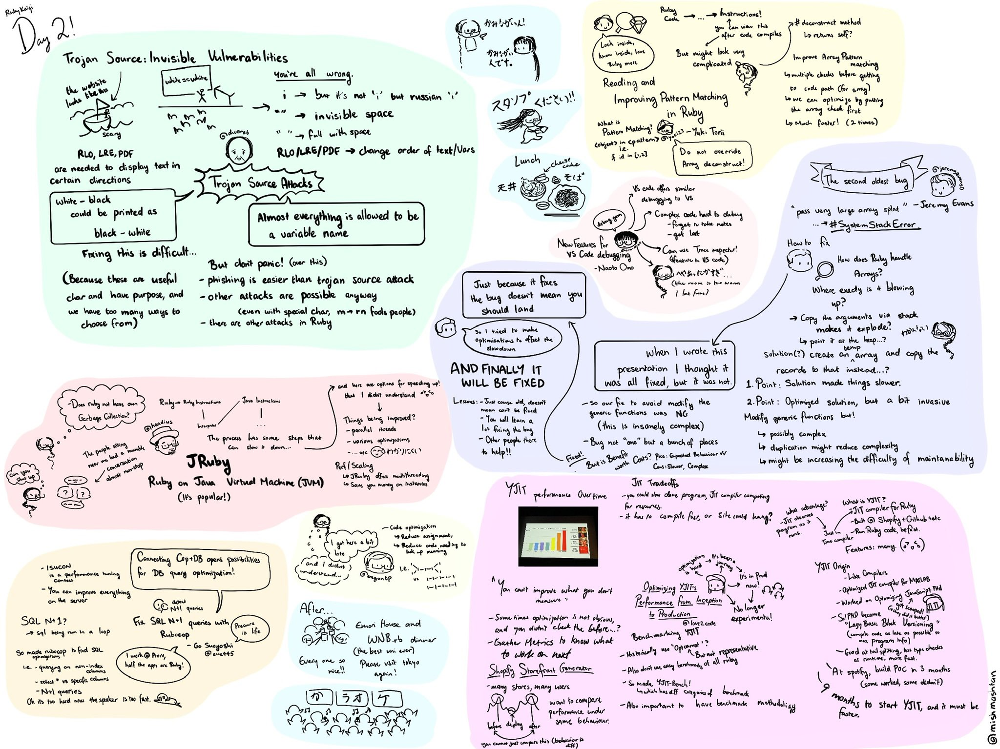

# RubyKaigi Matsumoto 2023


- https://rubykaigi.org/2023/

### Swag

- https://swanmatch.github.io/keeb_rubykaigi2023/

so popular that it sold out in 40 minutes when more units where made available
online
    - https://royal-keyboard-works.square.site/product/rk2023/19

also an interesting display of running ruby in browser with ruby.wasm
    - https://twitter.com/niku_name/status/1656496027783028741
    - https://twitter.com/logta15/status/1656520420827467777

---

## Wednesday 10th May

- https://keebkaigi.org/2023/
    - talks and tutorials on custom keybaords
    - https://twitter.com/hashtag/keebkaigi
    - https://speakerdeck.com/kakutani/keebkaigi-strikes-q
    - https://www.youtube.com/watch?v=Lk3-5ceJz4Y
    - cool keyboard coming soon
        - https://shop.yushakobo.jp/en/products/pre-order-cocot46plus
    - traveling keyboard hashtag
        - https://twitter.com/search?q=%23%E6%97%85%E3%81%99%E3%82%8B%E3%82%AD%E3%83%BC%E3%83%9C%E3%83%BC%E3%83%89&src=typed_query
- https://kaigi.karafka.io/
    - n00b to advanced karafka (Ruby Kafka processing framework)

---

## Thursday 11th May

### Yukihiro "Matz" Matsumoto (JA) - Keynote
Yukihiro "Matz" Matsumoto - @yukihiro_matz

a history of Ruby, how it came to be and why certain decissions where made as
well as learnings on how to be successfull when building open source software.


---

### RuboCop's baddest cop (EN)
Genadi Samokovarov - @gsamokovarov

a long winded journey of what it took to put together a roboCop rule to follow
the guidelines set out by the team, to avoid brackets in your code when you
can.

- https://www.rubydoc.info/gems/rubocop/RuboCop/Cop/Style/MethodCallWithArgsParentheses

---

### Understanding the Ruby Global VM Lock by observing it (EN)

Ivo Anjo @KnuX

a good explanation of GVL - Global VM Lock
- [RubyKaigi_2023_understanding_the_ruby_global_vm_lock_by_observing_it.pdf](./slides/RubyKaigi_2023_understanding_the_ruby_global_vm_lock_by_observing_it.pdf)
- https://ivoanjo.me/rubykaigi2023/
- https://docs.google.com/presentation/d/1GYoYnLij7YGnYGLgMSlRvBPSTEEVqFqUhowtkN4eH24/edit

---

### Develop chrome extension with ruby.wasm (JA)
Yuma Sawai - @3yUma₋rb

simple talk showing how to use `ruby.wasm` in a browser to create a Chrome
extension
    - https://github.com/aaaa777/ruby-chrome-extention-demo
    - and his framework in the making https://github.com/aaaa777/unloosen

---

### UTF-8 is coming to mruby/c (JA)
Mari Imaizumi - @ima1zumi

- great intro to UTF-8
- in particular examples where things break like, split, index, insert in strings
- as well as the structure of UTF-8 variable width bytes
- slides https://speakerdeck.com/ima1zumi/c-9f8bab18-7b38-4a6a-b0b2-56a9fda78a9f

---

### Plug & Play Garbage Collection with MMTk (EN)
Matt Valentine-House - @eightbitraptor

- https://www.eightbitraptor.com/presentations/RubyKaigi2023-mvh.pdf

---

### DIY Your Touchpad Experience: Building Your Own Gestures (JA)
Kohei Yamada - @nukumaro22

- https://speakerdeck.com/iberianpig/diy-your-touchpad-experience-building-your-own-gestures-rubykaigi2023

---

### Lightning talks

https://rubykaigi.org/2023/presentations/lt/

- Customize your Vim/Neovim directly with Ruby
    - using https://github.com/okuramasafumi/rspec-current.vim

- Ultra-fast test-driven development
    - rspec-daemon is an echo server implemented over TCP

---

## Friday 12th May

On Ruby and ꝩduЯ, or How Scary are Trojan Source Attacks (EN)
Martin J. Dürst - @duerst

- fascinating talk on using special characters to break your code for example:
    - special Cyrillic small letters like i (і: U+0456) and e (е: U+0435) using
      a homoglyph attack
    - and "Invisible Space Attacks"
        - U+200B: ZERO WIDTH SPACE
        - U+3000: IDEOGRAPHIC SPACE
        - RLO: 202E;RIGHT-TO-LEFT OVERRIDE
        - LRE: U+202A: LEFT-TO-RIGHT EMBEDDING
        - PDF: U+202C: POP DIRECTIONAL FORMATTING
- see demos here https://www.sw.it.aoyama.ac.jp/2023/pub/RubyꝩduЯ

---

### Learn Ractor (JA)
Masatoshi SEKI - @m_seki

- https://speakerdeck.com/m_seki/learn-ractor
- Ractor as alternative to Threads

---

### JRuby: Looking Forward (EN)
Charles Nutter - @headius

- another why JRuby is cool and more performant talk
- mostly of interest as Charlie helped us get our JRuby Android app compiled
  and running on an Android Phone

---

### Build a mini Ruby debugger in under 300 lines (EN)
Stan Lo - @_st0012

- I heard good things about this talk and getting a better understanding of
  ruby
- slides https://github.com/st0012/slides/tree/main/2023-05-11-rubykaigi

---

### Implementing "++" operator, stepping into parse.y (JA)
Misaki Shioi - @coe401_

- https://speakerdeck.com/coe401_/implementing-plus-plus-operator-stepping-into-parse-dot-y

---

### The Resurrection of the Fast Parallel Test Runner (JA)
Koichi ITO - @koic

- great overview of parallel testing
- push for gem https://github.com/tmm1/test-queue
- https://speakerdeck.com/koic/the-resurrection-of-the-fast-parallel-test-runner
- https://koic.hatenablog.com/entry/the-resurrection-of-the-fast-parallel-test-runner

---

### Multiverse Ruby (JA)
Chris Salzberg @shioyama

- a great overview of modules and namesapcing and the need for allowing isolated namespacing
- https://speakerdeck.com/shioyama/multiverse-ruby
- https://github.com/shioyama/im
- https://github.com/shioyama/rails_on_im
- someone elses notes 
    - https://tagomoris.hatenablog.com/entry/2023/05/15/174652

---

### Ruby Implementation of QUIC: Progress and Challenges (EN)
Yusuke Nakamura - @yu_suke1994

### Fitting Rust YJIT into CRuby (EN)
Alan Wu - @alanwusx

### The Second Oldest Bug (EN)
Jeremy Evans -  @jeremyevans0

- the 2nd oldest bug is not being able to do the following
  ```
  Hash[*1380888.times.map{ 1 }]
  ```
- so many arguments that you get a `stack level too deep (SystemStackError)`
- a story of
    - understanding the underlying C code
    - writing a fix
    - understanding enought about the code to add performance improvements to
      offset the cost of the fix
    - there are 80 long running bugs in ruby - go fix one
- slides https://code.jeremyevans.net/presentations/rubykaigi2023/index.html

---

## Saturday 13th May

### Build Your Own SQLite3 (JA)
Hitoshi HASUMI - @hasumikin

- using PicoRuby
- https://shimane.monstar-lab.com/hasumin/rubykaigi2023-picoruby-sqlite3
- https://slide.rabbit-shocker.org/authors/hasumikin/RubyKaigi2023/
- https://www.wantedly.com/companies/wantedly/post_articles/506740
- SQlite is making a comeback as an Edge network database
    - https://www.youtube.com/watch?v=Jib2AmRb_rk

---

### Gradual typing for Ruby: comparing RBS and RBI/Sorbet (EN)
Alexandre Terrasa - @Morriar

---

### Ruby + ADBC - A single API between Ruby and DBs (JA)
Sutou Kouhei - @ktou

ADBC
- https://www.clear-code.com/blog/2023/5/15/rubykaigi-2023.html
- ADBC Arrow DataBase Connectivity
- using Apache Arrow
- good for large data sets
- PostgreSQL will be Flight SQL ready soon
- ADBC via ActiveRecord is coming soon

---

### Ruby vs Kickboxer - the state of MRuby, JRuby and CRuby (EN)
Michael Milewski - @saramic
Selena Small -  @selenasmall88


but also pretty much summed up in this tweet
- https://twitter.com/nateberkopec/status/1657249112151175169

---

### Load gem from browser (JA)
SHIGERU NAKAJIMA - @ledsun

- slides https://speakerdeck.com/ledsun/load-gem-from-browsr
- using wasm
    - https://github.com/ruby/ruby.wasm
    - https://twitter.com/chobishiba/status/1657310435266424834
    - leads to example on https://p5rb.ongaeshi.me/editor/
    - using https://github.com/ongaeshi/p5rb/
    - P5.rb basedon P5.js
        - https://note.com/chobishiba/n/nbcaad9befa0d
        - https://note.com/chobishiba/n/n6d4b747e9f06
- also this explanation
    -  https://qiita.com/Takaharu_01/items/fac8829bebd59c441308

---

### Unleashing the Power of Asynchronous HTTP with Ruby (EN)
Samuel Williams - @ioquatix

- a history of HTTP and how the versions changed and the need for change
- finally the most recent versions of HTTP can now be written in 10 lines of
  succinct ruby code
- https://github.com/ioquatix/rubykaigi-2023
- my tweet https://twitter.com/saramic/status/1657269661128626180

---

### Let's write RBS! (EN) Masataka Kuwabara @p_ck_

A lot of talks on RBS, this was 1 of them
- https://speakerdeck.com/pocke/lets-write-rbs

---

### Parsing RBS (EN) - Keynote
Soutaro Matsumoto - @soutaro

- slides https://speakerdeck.com/soutaro/parsing-rbs
- https://github.com/soutaro/vscode-rbs-syntax

---

### some great notes
- https://blog.testdouble.com/field-reports/ruby-kaigi
- https://tech.medpeer.co.jp/entry/2023/05/15/162637
- on ruby wasm
    - https://qiita.com/Takaharu_01/items/fac8829bebd59c441308
    - https://github.com/ruby/ruby.wasm
- https://note.com/tonyfactory/n/nabf40e209d1b
- https://speakerdeck.com/kurotaky/ethereum-for-ruby?slide=26
- https://fuga-ch85.hatenablog.com/entry/2023/05/15/132504
- https://ylgbk.hatenablog.com/entry/2023/05/14/215355
- https://note.com/chobishiba/n/nbcaad9befa0d

### Mish

- https://www.tokyodev.com/2023/05/17/rubykaigi-2023-recap/
- 
- 

---

## Next years RubyKaigi in Okinawa

---

- a taste of what OkinawaRB might be like - from 2019 slides
https://speakerdeck.com/yasslab/okinawa-dot-rb?slide=24

### from the past

- https://speakerdeck.com/sue445/best-practices-in-web-api-client-development-number-rubykaigi
    - interesting idea to use CURL as the Debug for API failures - ie you can quickly call again, although it would include PII
