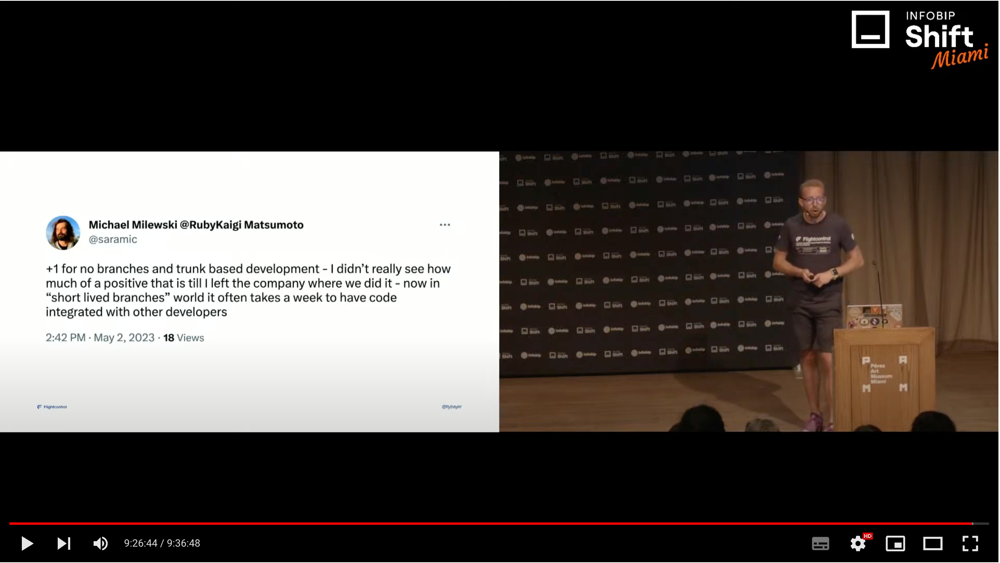

# Conferences 2023

A review of all the conferences in 2023

* as seen on [Melbourne Ruby](
  https://www.meetup.com/ruby-on-rails-oceania-melbourne/events/msjwdtyfchbpc/)
  - and originally proposed as https://github.com/rubyaustralia/melbourne-ruby/issues/205

* slides will be available https://failure-driven.github.io/conferences-2023/

## Notes

all my "raw" notes with a lot of links to videos etc

**2024**

- [NOTES_Programmable_Melbourne_2024.md](NOTES_Programmable_Melbourne_2024.md)
- [NOTES_DDD_Melbourne_2024.md](NOTES_DDD_Melbourne_2024.md)
- [NOTES_NDC_Sydney_2024.md](NOTES_NDC_Sydney_2024.md)

**2023**

- lastConf
- [NOTES_OpenConf_Athens.md](NOTES_OpenConf_Athens.md)
- [NOTES_RubyConfTH_Bangkok_2023.md](NOTES_RubyConfTH_Bangkok_2023.md)
- [NOTES_RubyKaigi_Matsumoto_2023.md](NOTES_RubyKaigi_Matsumoto_2023.md)
- [NOTES_RailsConf_Atlanta_2023.md](NOTES_RailsConf_Atlanta_2023.md)
- [NOTES_ReactMiami_Miami_2023.md](NOTES_ReactMiami_Miami_2023.md)
- [NOTES_Programmable_Melbourne_Sydney_2023.md](NOTES_Programmable_Melbourne_Sydney_2023.md)
- [NOTES_RubyConfAU_Melbourne_2023.md](NOTES_RubyConfAU_Melbourne_2023.md)
- [NOTES_RubyConfTH_Bangkok_2022.md](NOTES_RubyConfTH_Bangkok_2022.md)

## Plan

### Original form the issue

I have had the opportunity to attend a heap of recent ruby related conferences.
In this talks I will share:

1. what I have learnt
1. how I got to go
1. upcoming conferences
1. how to get the most out of conferences

The conferences covered are:

* RubyConfTH Bangkok 2022 & 2023
* RubyConfAU Melbourne 2023
* Programmable Melbourne/Sydney 2023
* TestBash Spring London | Remote 2023
* ReactMiami 2023
* RailsConf Atlanta 2023
* RubyKaigi Matsumoto 2023
* and coming soon CPP Canada, RustConf Albuquerque, ReactSummit Amsterdam |
  Remote, NDC Copenhagen

talk will be anywhere from 10min - 40min and include some audience interaction
and games if we go for the longer version

### What I can deliver

- Who am I
    - interactive code FTW
- How I got here
    - 100 submissions for 10 acceptances
        - show sessionize
            - https://sessionize.com/selena-small/
            - https://sessionize.com/michael-milewski/
        - and papercall process
            - https://www.papercall.io/submissions
        - take a look at https://rubyconferences.org/
    - criteria
        - get accepted, does it pay, go ✅
    - drivers
        1. swag,
           
        1. acceptance via CFP,
        1. credibility from talking
        1. reduce decissions around where to travel
        1. party 🎉
            - https://failure-driven.com/post/2022-12-15-ruby-conf-thailand-conference-notes/
   - underlying drivers
        1. actually completing things
        1. so what is new in the community
        1. be a better programmer - more completion, more experience, wider
           network
        1. equity
- list the Selena and Michael will code for swag tour 2023
    1. RubyConfTH Bangkok 2022
    1. RubyConfAU Melbourne 2023
    1. Programmable Melbourne/Sydney 2023
    1. TestBash Spring London | Remote 2023
    1. ReactMiami 2023
    1. RailsConf Atlanta 2023
    1. RubyKaigi Matsumoto 2023
    1. ReactSummit Amsterdam | Remote 2023
    1. NDC Copenhagen 2023
- big win being quoted by others
    - 
    - 
    - via https://twitter.com/saramic/status/1661189417736740868
- had to even say NO - CPP North, RustConf Albuquerque and a few others

### Recurring themes

* Speed of SQL
* WebAuthn and PassKeys
* Rails modularisation
* AI Pair programming
* All things cloud

### Code Samples

* ✅ [demo/fast_sql](demo/fast_sql)
* [demo/open_telemetry](demo/open_telemetry)
* [demo/capybara_scrape](demo/capybara_scrape)
* [demo/race_condition](demo/race_condition)
* ✅ [demo/special_characters](demo/special_characters)
* ✅ [demo/pass_key](demo/pass_key)
* ✅ [demo/picoruby_keyboard](demo/picoruby_keyboard)

### Must Watch List

list of must watch

#### RubyConfTH Bangkok

Nate Berkopec @nateberkopec

---

Jeremy Evans @jeremyevans0

---

Ratnadeep Deshmane @rtdp

Content is super valuable here for people who want to understand better how
rails works by understanding it's parts, in particular:

- rake
- rack
- ActiveSupport
- hash_with_indifferent_access gotchas
- ActiveRecord
- ActiveModel
- ActiveMailer - running as standalone mailer
- ActiveJob
- templates: ERB
- Parts that are too intertwind to run individually (learn them in rails):
    - ActionCable,
    - ActionVeiew,
    - ActionController
- DSLs in rails/ruby - RSpec, Routes
- look at route alternatives: sinatra/hanami/Roda

#### RubyConfAU Melbourne

#### Programmable

#### ReactMiami

#### RailsConf Atlanta

Watch for the following appearing https://www.youtube.com/@RubyCentral/videos

- Taylor’s Guide to Big Rewrites
    - Andy Croll
    - https://railsconf2023.sessionize.com/session/445621

- How to Have The Slowest Rails App Ever
    - Nate Berkopec
    - https://railsconf2023.sessionize.com/session/451197

- Mentorship in Three Acts
    - Adam Cuppy
    - https://railsconf2023.sessionize.com/session/452856

- Rails as a piece of birthday cake
    - Vladimir Dementyev
    - https://railsconf2023.sessionize.com/session/452834

- Off to the races
    - Kyle d'Oliveira
    - https://railsconf2023.sessionize.com/session/451054

- Keynote - Aaron Patterson
    - Aaron Patterson
    - https://railsconf2023.sessionize.com/session/471439

- Catch Me If You Can: Learning to Process Webhooks in Your Rails App
    - Colin Loretz & Chris Oliver
    - https://railsconf2023.sessionize.com/session/453439
        - code https://github.com/colinloretz/railsconf-webhooks
        - tutorial https://gorails.com/episodes/how-to-process-inbound-webhooks-railsconf-2023

#### RubyKaigi

probably watch for them being uploaded here
    - https://www.youtube.com/channel/UCBSg5zH-VFJ42BGQFk4VH2A

- Build a mini Ruby debugger in under 300 lines (EN)
    - Stan Lo @_st0012
    - https://rubykaigi.org/2023/presentations/_st0012.html#day2

- Multiverse Ruby (JA)
    - Chris Salzberg @shioyama
    - https://rubykaigi.org/2023/presentations/shioyama.html#day2

- The Second Oldest Bug (EN)
    - Jeremy Evans @jeremyevans0
    - https://rubykaigi.org/2023/presentations/jeremyevans0.html#day2

- Unleashing the Power of Asynchronous HTTP with Ruby (EN)
    - Samuel Williams @ioquatix
    - https://rubykaigi.org/2023/presentations/ioquatix.html#day3

### Thank You

